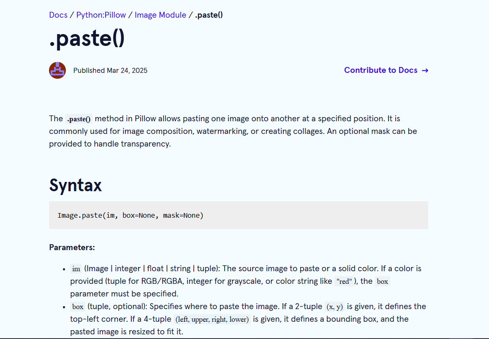

### Learning Progress (17/03/2025 - 23/03/2025)

- **I practiced making a pull request on the [fork-commit-merge](https://github.com/fork-commit-merge) repository.** I made a few mistakes with my commits so I wanted to reverse the changes. There are a couple of ways to do that, but the safest is using `git revert`. It's safe because it reverses the changes in a new commit without destroying the previous ones. This ensures that you don't cause conflicts in the history of the repository when working with other contributors. 

- **I contributed to [Docs](https://www.codecademy.com/resources/docs).** A reference for programming terms and concepts. I took on an issue that involved writing some [documentation](https://www.codecademy.com/resources/docs/pillow/image/paste) for a function. I gained exposure on the workflow for big projects. Luckily there weren't a lot of issues and it went smoothly.

- **I started learning about system design.** It was only introductory, but I gathered that system design is important because it ensures that the technologies used in building a service or product help meet the requirements of the users and stakeholder. Decisions on the kind of data and the mode of transmission are made long before a service is built. There are also design patterns which are solutions to common problems encountered when creating a service.

- **I read about classes in javascript.** I learned the syntax for constructors, getters, setters and inheritance. I also learned about abstract classes and how they can be implemented in javascript by using error handling.

- **I learned a bit about graphs**. While trying to solve a programming problem, I realized the data could be represented with a graph. I ended up using a directed graph their structure with an adjacency list. I also used a depth first search algorithm which explores as far as possible down a branch before backtracking.
